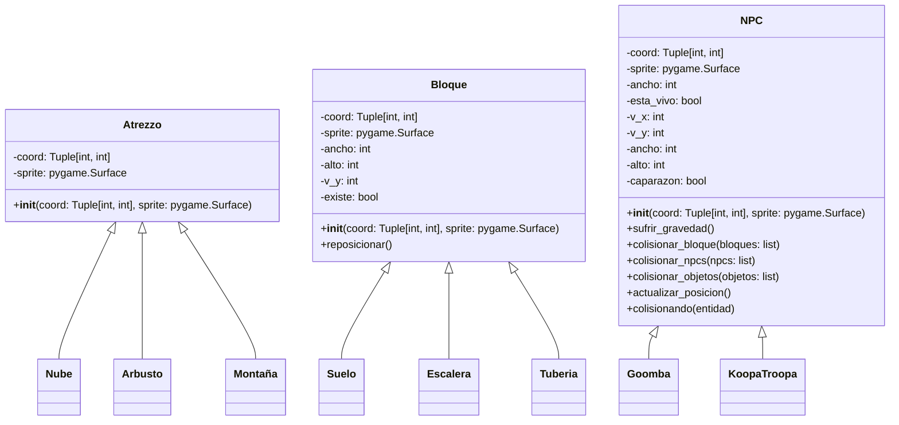

## Sobre el proyecto

Este proyecto fue un clon del juego de Mario Bros que creé para la asignatura de **Programación** de la **UC3M**. El juego fue desarrollado en **Python** y **Pygame** y es una replica del primer nivel del juego original de Mario Bros.

El objetivo del proyecto era aplicar los conocimientos adquiridos en la asignatura de programación y aplicar programación orientada a objetos y el uso de librerías en Python.

## Implementación

### Diseño de clases
Un punto importante de la implementación fue la creación de las clases que representaban los distintos elementos del juego, como el jugador, los enemigos, las monedas, los bloques, etc. Respetando la programación orientada a objetos y la modularidad del código y una organización clara y sencilla en la estructura del proyecto. Para ello nosotros creamos las siguientes clases:



Las clases heredadas asi como la clase objeto y player no se muestran en el diagrama por simplicidad, pero se pueden ver en el [código fuente del proyecto](https://github.com/Ragarr/UC3M/tree/main/Proyectos%20y%20practicas/1%C2%BA/Programacion/Proyecto%20-%20Mario%20Bros).


### Game

Es la clase principal, así mismo es el único archivo que debe ser ejecutado. La clase game cuenta con 17 métodos, cada uno con una función. En un principio íbamos a crear una clase menú y una clase nivel, sin embargo decidimos integrar ambas en la misma clase ya que generaba mucha complejidad y no ayudaba a la legibilidad del codigo, además suponía cambiar los cimientos de lo que ya estaba desarrollado.

#### Update

El método tiene tres preguntas para distinguir si nos encontramos en el menú de inicio, en el de muerte o en el propio nivel. Si nos encontramos en el menú de muerte y pulsamos intro llamara al método `reset_level()`, a no ser que hayamos perdido todas las vidas en cuyo caso llamara al método `reset_game()`. Cuando se realiza la ejecución del nivel llama a métodos propios de cada clase que actualizan el estado de todos los objetos. Además ejecuta el método `mantener_jugador_en_pantalla()` y `borrar\_entidades()`

#### Draw

Se encarga de dibujar todo en pantalla. Sigue las mismas tres preguntas que update para dibujar los menús o el nivel. Cuando dibuja el nivel, por optimización, solo dibuja los elementos que hay en el visor, para ello utiliza la pregunta

```python
if not self.item_a_dibujar[i].coord[0]>1.5*pyxel.width:
```
para determinar si el elemento esta dentro o cerca del visor y dibujarlo y después va dibujando elemento a elemento mediante bucles for. Tambien tiene un apartado especial para dibujar al jugador y a los efectos de la estrella si es que tuviera. Por ultimo dibuja la interfaz.

#### Generar\_suelo, objetos, atrezzo, bloques y npcs

Son 5 metodos distintos encargados de crear una lista con las posiciones de los elementos del nivel. A pesar de que el suelo son bloques lo generamos aparte ya que usamos bucles while para generarlo mas cómodamente y pensamos que seria mas visual tenerlos por separado

#### Mantener jugador en pantalla y desplazar nivel

Detecta las coordenadas del jugador para que en caso de llegue a la mitad de la pantalla llamara al método `desplazar_nivel()` para transmitir su movimiento a los demás objetos (modificando sus coordenadas) haciendo así que el nivel se mueva a su alrededor.

#### Redondear


Al trabajar con velocidades decimales obtenemos una mejor sensación de juego, como por ejemplo con las inercias, la suavidad del salto, etc. Sin embargo esto significa que existen las coordenadas decimales y al dibujarse se aproximan a enteros, el método ``round`` de Python presenta el problema de que no siempre aproxima igual, ej: ``round(1.5)=2`` y ``round(2.5)=2`` cuando desearíamos un resultado más consistente que redondeara siempre hacia abajo (o arriba) a partir del 0.5, por lo tanto creamos este método que haciendo uso de round y restando un número muy pequeño permite aproximar los valores de forma consistente evitando que se formen huecos que a pesar de ser únicamente visuales no son nada estéticos.

|Con Redondeado|Sin Redondeado|
|---|---|
| |  |


#### Reset level y game

Estos métodos reinician respectivamente el nivel y el juego, al reiniciar el nivel el jugador conserva únicamente sus vidas y al reiniciar el juego no se conserva nada, creamos un método reiniciar juego en vez de volver a llamar al ``__init__`` de game ya que esto hacia que se reiniciara pyxel y se crearan mas ventanas, dando muchos problemas.

#### Borrar entidades

Se encarga de borrar todos los elementos que desaparecen (bloques, objetos, npcs muertos, etc), así como de borrar aquellos que abandonan el visor por la izquierda, los bloques que salen por la izquierda no son eliminados ya que si nos desplazamos rápido al eliminar tantos objetos generaba lag.

### Player

Es la clase mas importante y que mas trabajo hace del juego. Los métodos más importantes son:

Colisionar bloques primero comprueba las colisiones en el eje y para hacer que no te caigas de los bloques y que los golpes al colisionar desde abajo, después comprueba las colisiones en el eje x para hacer que no atravieses bloques horizontalmente. Al colisionar por encima de un bloque automáticamente cambia tus coordenadas a las del bloque + tu alto para que no te quedes atravesándolo parcialmente si vas muy rápido, esto también causa que subas escalones automáticamente. también al golpear un bloque inferiormente se te aplica el doble de gravedad para evitar que no lo atravieses nunca.

Colisionar npcs detecta si chocas con un npc y si lo haces verticalmente u horizontalmente, si chocas verticalmente llamas al método colisionar\_jugador de el npc y si chocas horizontalmente llamas a tu método recibir\_daño. Además si eres estrella solo se considera si chocas de cualquier manera con el npc y llama a su método morir directamente. Al colisionar verticalmente te da 15 frames de invulnerabilidad para que no se reciba mas de un impacto seguido

Colisionar objetos simplemente detecta si colisionas un objeto y comprueba de que tipo es para cambiar el estado del jugador como sea necesario.

El método colisionar() en general es un método auxiliar que se usa en todos los anteriores y comprueba las coordenadas de una entidad respecto al jugador.

El método detectar botones detecta las teclas y le transmite velocidad al jugador, también detecta cuando no se pulsa nada para aplicar el coeficiente de rozamiento al jugador(esto hace que frene de una manera muy natural y no en seco).

Los métodos actualizar_animaciones. ``Coger_bandera``, ``Fase1_bandera`` y ``fase2_bandera`` son métodos de animaciones que únicamente cambian el sprite del jugador para que se adapte a si esta andando saltando o deslizándose por la bandera. Funcionan mediante basicamente

```python
if pyxel.frame_count % (c.fps/un_numero) == 0: cambiar sprite
```

que hace que se vayan alternando los sprites cada n fotogramas, tambien se detecta si la velocidad del jugador y hacia donde mira no coincide para derrapar y si estas saltando para poner el sprite de salto.

Lanzar fuego simplemente añade a la lista de objetos una bola de fuego en la dirección a la que estes mirando.

Por último el método ``reset_state`` reinicia los atributos que deben reiniciarse al comienzo del nivel y al morir.


## Problemas encontrados

### Colisiones

El principal problema que hemos encontrado en el desarrollo del juego fue hacer un sistema de colisiones coherente, eficiente y universal. Cosa que al final hemos logrado en cierta medida, a pesar de que sigue habiendo algunas comprobaciones que deberían evitarse pero no hemos sido capaces de mejorar. Nos inspiramos en otros sistemas de colisiones AABB pero no fuimos capaces de crear un sistema AABB perfecto y tenemos una mezcla de AABB con algo propio nuestro.

### Animaciones

La interacción de las animaciones con las colisiones nos ha dado bastantes problemas en general, sobre todo en las setas y demás objetos que aparecen dentro de bloques

### Menú
``` py
class game():
	...
class menú(game):
	...
class nivel (game):
	...
```

En un principio planteamos los menús como una clase aparte de la siguiente forma, sin embargo, nos presentó tantos problemas a un nivel tan básico del juego que había que cambiar el funcionamiento de prácticamente todo lo que ya estaba hecho, así que decidimos apañarlo todo dentro de la misma clase game.

## Conclusión

Este se trata de un muy buen proyecto para iniciarse en la programación orientada a objetos, que obliga al desarrollador a emplear una organización correcta para poder tratar con todos los objetos y entidades diferentes que existen sin que sea caótico.

Es un buen primer proyecto en python.