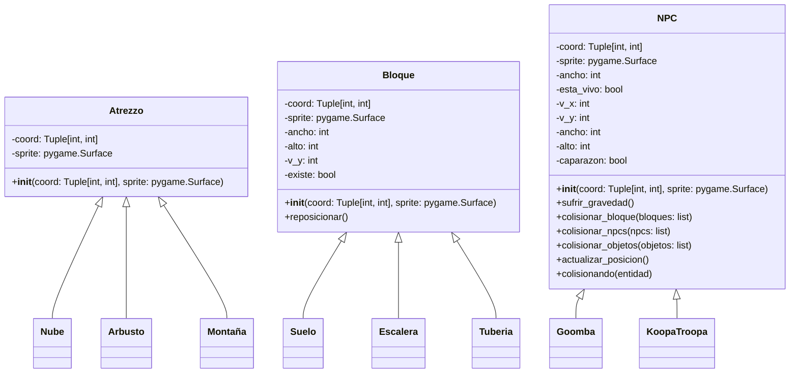

## About the project

This project is a clone of the **first level** of *Super Mario Bros* that I built for the **Programming** course at **UC3M**. The game is written in **Python** using the **Pyxel** retro game engine. The goal was to apply OOP principles, use external libraries, and practice clean, modular code in a medium‑sized project.

## Implementation

### Class design
A key part of the implementation was designing classes for the different game entities (player, enemies, coins, blocks, etc.) following OOP and keeping a clear, modular structure. We created (among others) the following classes:



> Note: For brevity, inherited classes (and the base `Objeto` and `Player`) are not shown in the diagram. You can see the complete code in the repository: [project source code](https://github.com/Ragarr/UC3M/tree/main/Proyectos%20y%20practicas/1%C2%BA/Programacion/Proyecto%20-%20Mario%20Bros).

### `Game`
This is the main class and the only file that must be executed. Initially, we considered separate `Menu` and `Level` classes, but we integrated both into `Game` to reduce complexity and improve readability.

#### `update`
Handles three states: start menu, death menu, and level. In the death menu, pressing **Enter** calls `reset_level()` unless all lives are lost, in which case it calls `reset_game()`. During level execution, it calls the update methods of each class, runs `keep_player_in_view()` and `delete_entities()`.

#### `draw`
Draws everything on screen. It follows the same three states as `update`. For performance, it only draws items that are within (or close to) the viewport, using a predicate similar to:

```python
if not self.item_a_dibujar[i].coord[0] > 1.5 * pyxel.width:
    ...
```
After that, it draws element by element (with `for` loops), then the player and star effects (if any), and finally the HUD.

#### Generate ground, objects, set‑dressings, blocks and NPCs
Five helper methods create lists with positions of level elements. Ground is generated separately (despite also being blocks) because it’s easier and clearer to produce with `while` loops.

#### Keep player in view & scroll level
Tracks player coordinates; once the player reaches the middle of the screen it calls `scroll_level()` so the world moves around the player by adjusting object coordinates.

#### Rounding
Working with fractional velocities gives better game feel (inertia, smooth jumps, etc.), but it produces decimal coordinates. Python’s `round` can be asymmetric (e.g., `round(1.5) == 2` and `round(2.5) == 2`). We implemented a small wrapper that subtracts an epsilon before rounding to keep visuals consistent and avoid gaps.

| With rounding | Without rounding |
|---|---|
|||

#### `reset_level` & `reset_game`
`reset_level` restarts the level preserving only lives; `reset_game` resets everything. We avoided re‑calling `Game.__init__` to prevent Pyxel from re‑initializing and spawning extra windows.

### `Player`
This is the most important and busiest class.

- **Block collisions**: first checks Y collisions (prevent falling through platforms and handle head bumps), then X collisions (avoid passing through walls). Standing on a block snaps the player to its top to prevent partial penetration at high speeds (also enables automatic step‑ups). Hitting a block from below temporarily doubles gravity to ensure the player doesn’t clip through.
- **NPC collisions**: detects collisions and whether they’re vertical or horizontal. Vertical collisions call `npc.colisionar_jugador`, horizontal collisions trigger `recibir_daño`. When in star state, any collision kills the NPC. After a vertical hit, the player gets 15 frames of invulnerability to avoid multi‑hits.
- **Object collisions**: detect pickups and update player state accordingly.
- **Input handling**: maps key presses to velocity, applies friction when no input is pressed for natural deceleration.
- **Animations**: `actualizar_animaciones`, `coger_bandera`, `fase1_bandera`, and `fase2_bandera` switch sprites based on state (walk/jump/flag slide), e.g.:

```python
if pyxel.frame_count % (c.fps / n) == 0:
    cambiar_sprite()
```

- **Fireballs**: adds a fireball object in the facing direction.
- **`reset_state`**: resets attributes at level start and on death.

## Issues encountered

### Collisions
Designing a collision system that is coherent, efficient, and general‑purpose was the main challenge. We took inspiration from AABB systems but ended up with a hybrid approach tailored to our needs.

### Animations
Interactions between animations and collisions caused several issues—especially with mushrooms and other objects that spawn from blocks.

### Menu
```py
class game():
    ...
class menu(game):
    ...
class nivel(game):
    ...
```
We initially planned menus as a separate class hierarchy, but it caused too many low‑level issues. We decided to keep everything inside the `Game` class for stability and simplicity.

## Conclusion
This is an excellent first OOP project in Python: it forces you to organize code properly to manage many different entities without chaos. A solid **first game project** in Python.