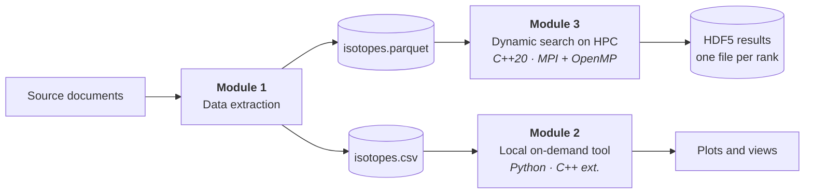
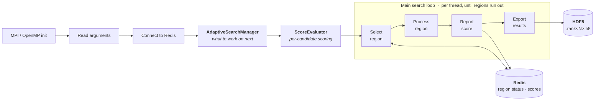

My BSc thesis in Computer Engineering at Universidad Carlos III de Madrid was carried out at the
**IQOG-CSIC**, with the PNRG group, under David Expósito Singh (UC3M) and Pedro Noheda Marín
(IQOG-CSIC). It was graded **9.6/10**.

The engineering problem was not the science. It was that the search space the science implies is far
too large to enumerate, and the people who needed to explore it needed to do so *interactively* —
steering the search while it ran, rather than submitting a batch job and reading the results the next
morning. Those two requirements pull in opposite directions, and the thesis is largely about the
architecture that reconciles them.

The result was a **hybrid platform**: a distributed C++ search engine running on CSIC's **DRAGO**
supercomputer, coupled to a local interactive tool, with **Redis** as the coordination boundary
between them.

> The dataset and the domain-specific scoring functions belong to the PNRG group and are confidential,
> so this write-up covers the engineering and the measured performance only. The source code was
> deliberately never published.
{: .prompt-info }

## 1. The problem: why the space explodes

The search runs over **subsets** of a catalogue of nuclear elements and states. For $n$ items and a
set of admissible subset sizes $S$, the space is

$$C_{\text{total}} = \sum_{k \in S} \binom{n}{k}$$

which for the catalogue in question reaches $2^{118} \approx 3.3 \times 10^{35}$ candidates. That is
not a number you reduce by being clever about constant factors. Exhaustive enumeration is not a slow
strategy, it is a category error.

Each candidate is scored by a set of domain metrics, and the subsets that matter are the ones with
extreme or unusual scores. They are rare, unevenly distributed, and — this is the part that drives
the whole design — **not known in advance**. The search cannot be planned at submission time, because
where it should go next depends on what it has already found.

A search whose shape is fixed before it starts can be a batch job. A search whose shape depends on
intermediate results cannot.

## 2. Why neither local nor HPC alone was sufficient

**Purely local** fails on throughput. Scoring candidates is expensive and the work is embarrassingly
parallel, so a workstation gives up orders of magnitude the problem could genuinely use.

**Purely HPC** fails on interaction. A supercomputer is a batch environment: work is queued,
scheduled, and run with no human in the loop. Queue latency alone destroys the interaction loop,
before considering that compute nodes are not where an exploratory visualisation front-end belongs.

The hybrid design sends the throughput-bound half to DRAGO, keeps the latency-bound, human-facing half
local, and pays for a coordination boundary between them.

## 3. Architecture

The compute side is **C++20** with **MPI** (OpenMPI 4.1.4) across DRAGO's nodes and **OpenMP** within
each of them, built with GCC 12 at `-O3` and scheduled through **SLURM**. C++20 specifically, because
it guarantees atomic `fetch_add` on floating-point types — which the shared score counters need.

The local side is Python 3.11 for interactive querying and plotting, with the hot paths pushed into
C++ extensions through Pybind11 so the same algorithms back both environments.

The platform is three modules, and the split follows the two access patterns rather than any
organisational tidiness: one path prepares data once, and two paths consume it very differently.

Module 1 runs once and produces a single consolidated file that is the source of truth for both
consumers. Module 3 is the throughput path; Module 2 is the latency path. They deliberately share no
runtime dependency — the HPC code does not need Python, and the local tool does not need MPI — which
is why the same machine never has to satisfy both dependency sets.

### Execution lifecycle

All ranks load the input, instantiate the two long-lived components, and synchronise on an MPI
barrier. The `AdaptiveSearchManager` owns the decision of what to work on next; the `ScoreEvaluator`
owns the per-candidate computation. Keeping those separate is what makes the scoring swappable
without touching the distribution logic.

Each rank then spawns OpenMP threads that loop independently: **ask for a region, evaluate every
candidate in it, report the score, repeat** — until the regions run out. Threads never coordinate with
each other directly, and ranks never message each other during the loop; both talk to Redis instead.
The loop terminates when the manager reports no regions left or a configured iteration limit is hit,
at which point each rank flushes its HDF5 buffers, closes its file, releases Redis and calls
`MPI_Finalize()`.

The division of labour is deliberate and worth stating plainly, because each of the three parallelism
technologies does exactly one job: **MPI** for startup, teardown and process topology; **OpenMP** for
saturating the cores inside a node; **Redis** for every irregular, data-dependent decision in between.
Nothing in the hot loop needs a collective, which is why adding nodes costs so little.

### Regions and combinatorial indexing

A **region** is a contiguous block of global lexicographic indices — region $i$ covers indices
$[i \cdot R,\ (i+1) \cdot R - 1]$. That definition is what makes the whole thing distributable: a
region is fully described by one integer, so handing work to a thread on another node costs nothing.

To make it usable, a thread has to be able to jump straight to an arbitrary index without generating
everything before it. That is a combinatorial **unranking** problem, solved here with binomial counts
and a binary mask: locate which subset-size block the global index falls into, subtract the offset,
then construct the mask with exactly $K$ bits set corresponding to that rank. The positions of the set
bits are the subset.

Unranking is comparatively expensive, so it is used once per region, for the first index; the rest of
the block is walked incrementally with a `next_comb` step. Random access where it is needed, sequential
speed everywhere else.

All of this runs on Boost.Multiprecision `cpp_int`, because 118-bit indices overflow every native
integer type available.

### Adaptive work distribution

The interesting part is how the next region gets chosen. On each request, the manager assembles a
candidate set from two sources: regions **neighbouring** ones that recently finished (within a window
of a few indices, scored by extrapolating from the neighbour and attenuating with distance), and a
handful of **uniformly random unexplored** regions. It then takes the argmax of the estimated score
over whatever is still free:

$$r^{*} = \underset{r \in \mathcal{S} \cap \mathcal{A}_t}{\arg\max}\ \hat{s}_r$$

On top of that, a fixed fraction of threads — around 30 % — are designated pure explorers and draw
uniformly from the whole space regardless of local scores, so the search cannot collapse into one
promising neighbourhood and stay there.

The reason for sampling rather than maintaining global statistics is scale: with $10^{35}$ candidates
you cannot keep a visit counter per region. The estimate has to be built from a local sample at the
moment of the decision.

## 4. Storage: Arrow, Parquet and HDF5

Input is **Apache Parquet** read through **Apache Arrow**; output is **HDF5**. Neither is the default
choice, and both were argued rather than assumed.

**Why not CSV for input.** CSV has no schema, no types, no compression, and no structure a reader can
exploit — every read is a full parse and every numeric column is a string until proven otherwise.
Parquet is columnar and compressed, and Arrow reads it into columnar memory **multi-threaded, directly
in C++**. On DRAGO that matters twice over, because the shared filesystem is **Lustre**: every rank
reads the same consolidated file concurrently, and both layers are built to serve exactly that pattern.
CSV was kept only as a secondary export for interoperability.

**Why not a relational database.** The access pattern is wrong for one. This is bulk append-only
analysis: write a great many records, then read whole columns of them. No updates, no transactions
worth the name, no joins on the hot path. A DBMS would add an operational dependency and a
serialisation bottleneck in exchange for guarantees the workload never uses — and it would have to be
reachable from every compute node.

**Why HDF5 for output.** Results are hierarchical rather than flat: each explored candidate carries
scalar scores plus, conditionally, larger derived structures. HDF5 stores that natively — one group
per candidate, metrics as attributes, derived structures as datasets, and only the pieces that were
actually computed.

The write path is shaped by the parallelism rather than the format. **Each rank writes its own file**
(`.rank<N>.h5`), which removes inter-process write contention entirely, and within a rank the threads
accumulate results in in-memory buffers that are flushed in batches, which keeps I/O off the critical
path. Nothing is shared, so nothing needs locking.

## 5. Coordination through Redis

Redis, via `hiredis`, is the shared state between processes and nodes. It holds which regions are in
progress or finished, per-region scores, and the global counters.

The reservation is the load-bearing part. A thread claims a region with **`HSETNX`** — set-if-not-exists,
atomic — so two threads on two different nodes cannot take the same region, and no consensus protocol
is needed to guarantee it. On finishing, the thread reports the accumulated score, which updates both
the region's status and the sample that feeds later neighbourhood estimates.

The reason this is Redis and not MPI messages is that the assignment pattern is irregular and
data-dependent. Expressing "whichever thread finishes first takes the best remaining region" in
explicit MPI point-to-point would mean building a distributed work queue by hand. An atomic key-value
store already is one.

The same state doubles as a **telemetry channel**: because progress, scores and per-core position are
all already in Redis, a long run can be watched from outside without instrumenting the compute path.

## 6. Results and performance

Measured on **DRAGO** — nodes of 2× Intel Xeon (24 cores each, 48 threads per node), 192 GB RAM,
Lustre, and a non-blocking Infiniband HDR fat-tree.

### Intra-node scaling (OpenMP, fixed problem, one node)

| Threads | Time (s) | Speedup | Efficiency |
|--:|--:|--:|--:|
| 1 | 657.51 | 1.00× | 100 % |
| 2 | 158.24 | 4.16× | 208 % |
| 8 | 37.62 | 17.48× | 218 % |
| 16 | 17.79 | 36.97× | 231 % |
| 32 | 10.77 | 61.06× | 191 % |
| 48 | 9.40 | 69.93× | 146 % |

_Speedup against OpenMP thread count. Axis labels are from the original thesis figures, in Spanish._

The speedup is **superlinear** up to about 16 threads, peaking at 231 % efficiency. That is not a
measurement error: splitting the work shrinks each thread's working set enough to change its cache
behaviour, so the parallel version is doing genuinely cheaper work per candidate, not just more of it
at once. Past 32 threads, memory bandwidth and synchronisation overhead take it back — efficiency
falls to 146 % at 48 threads, though wall-clock still improves.

_Parallel efficiency (speedup ÷ threads) on one node._

The headline: a computation that takes **11 minutes** on one thread finishes in **9.4 seconds** on a
full node.

### Multi-node scaling (MPI, 16 threads per node)

| Nodes | Total threads | Time (s) | Speedup | Efficiency |
|--:|--:|--:|--:|--:|
| 1 | 16 | 18.22 | 1.00× | 100 % |
| 2 | 32 | 9.83 | 1.85× | 92 % |
| 4 | 64 | 5.45 | 3.34× | 84 % |
| 8 | 128 | 3.01 | 6.05× | 76 % |

_Speedup against node count, 16 OpenMP threads per node._

Sublinear, as expected, and the decay is legible: 92 % at two nodes down to 76 % at eight. At eight
nodes roughly a quarter of the time is going to coordination rather than computation. Larger node
counts were not tested — cluster quota, not a technical limit.

### Weak scaling (100k candidates per thread)

| Threads | Total candidates | Time (s) | Efficiency |
|--:|--:|--:|--:|
| 1 | 100,000 | 69.6 | 100 % |
| 2 | 200,000 | 33.3 | 209 % |
| 8 | 800,000 | 32.5 | 214 % |
| 16 | 1,600,000 | 33.1 | 210 % |
| 24 | 2,400,000 | 36.5 | 191 % |
| 32 | 3,200,000 | 42.1 | 165 % |
| 48 | 4,800,000 | 54.8 | 148 % |

_Wall-clock time as data and threads grow together._

Wall-clock stays flat around 30–35 seconds from 2 to 16 threads while the workload grows sixteenfold.
The extreme point is the one worth quoting: **48 threads processed 48× the data in 54.8 s, against
69.6 s for a single thread on 1/48th of it.** More work, less time.

### Where the time actually goes

Profiling with `gprof` produced the most useful result in the whole evaluation, and not a flattering
one. With the expensive scoring enabled, **85 % of CPU time was spent in
`std::vector<>::_M_realloc_insert`** — reallocating and copying vectors while building intermediate
structures. Linear-algebra routines accounted for single-digit percentages; the combinatorial engine
barely registered.

With the heavy scoring disabled, the profile flattens into list normalisation (~44 %) and sequence
generation (~25 %), which is roughly what you would hope.

So the bottleneck was never the search. It was memory management inside one scoring implementation —
a component deliberately designed to be swappable, and one that had been written for correctness with
no attention paid to allocation.

## 7. Observability

Monitoring rode on the coordination layer rather than being built separately. Because region status,
scores and progress counters already live in Redis for correctness reasons, an external observer can
poll them and watch a long run without touching the compute path or adding instrumentation overhead.

A proper dashboard on top of that — reading Redis and rendering it in **Grafana** — was designed but
not built; it stayed on the future-work list when the project's hours ran out. Everything it needed
was already in the store.

## 8. What I would do differently today

Some of this I thought at the time. Some only became clear after a year of writing production firmware
and then coming back to research.

**I would not have hard-coded the tuning parameters.** Region size, exploration ratio, neighbourhood
window, sample size, buffer sizes — all of them are compile-time constants in the source, and no
sensitivity analysis was ever run over them. That is two failures in one: the system cannot be tuned
per workload, and I cannot tell you how much of the measured performance is the design versus one
lucky guess at a region size. Config file first, then the sweep.

**I would take the central coordinator seriously as a scaling limit.** Redis was the right call for
tens of processes and made the adaptive assignment almost free to implement. But it is a single point
every thread contends on, and at hundreds of processes it becomes the bottleneck by construction. A
hierarchical scheme — node-local coordinators reconciling against a global one — is the obvious next
step, and it is much easier to design in than to retrofit.

**I would profile before optimising anything, and I would profile earlier.** The 85 % figure is the
single most valuable number in the thesis, and I got it near the end. Everything I would have guessed
about where the time went was wrong.

**I would not store everything.** The strategy was to write out every explored candidate for maximum
fidelity in later analysis. At this problem's scale that produces output volumes that become their own
engineering problem — a filtering criterion at write time, keeping only candidates that clear a
relevance threshold, would have cost almost nothing and saved a great deal.

**I would make the extension point actually usable.** Adding a new scoring metric requires writing C++
and recompiling the whole thing. For a platform whose users are domain scientists, that is a barrier
that decides whether the tool gets adopted at all. A Python or declarative path for metrics, even a
slow one, would have been worth more than any of the performance work.

---

*Supervised by David Expósito Singh (UC3M) and Pedro Noheda Marín (IQOG-CSIC). Listed on the
[Publications](/publications/) page.*
